# **Software Engineering Methods Coursework** 

  

A system to allow easy access to a database which provides world population information. This coursework is being worked on as a Scrum Team by Group 6 - see the [CODE_OF_CONDUCT.md](CODE_OF_CONDUCT.md) file for more details.

## Build Statuses

* Master Branch    

* Develop Branch    

## Authors

* **Namo Najem** - *Development Team*.
* **Pablo Ferrando** - *Product Owner and Development Team*.
* **Ryan McLoughlin** - *Scrum Master and Development Team*.

## Requirements Met

We have implemented 32 requirements of 32, which is 100%.

| ID    | Requirement | Met  | Screenshot |
|-------|------|------|------------|
| 1     | All the countries in the world organised by largest population to smallest. | Yes | 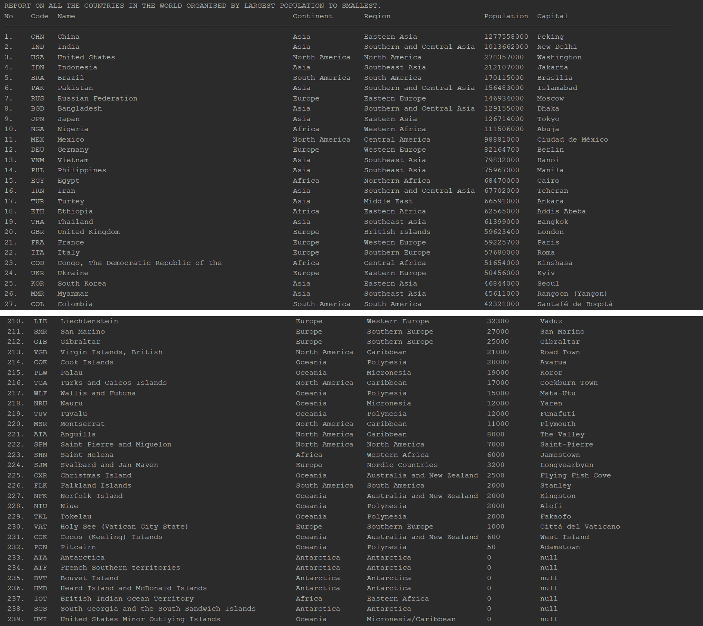 |
| 2     | All the countries in a continent organised by largest population to smallest. | Yes |  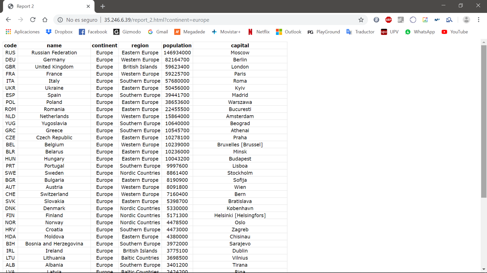 |
| 3     | All the countries in a region organised by largest population to smallest. | Yes | 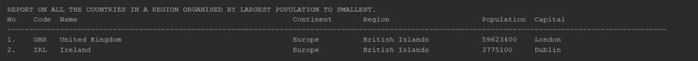 |
| 4     | The top N populated countries in the world where N is provided by the user. | Yes | 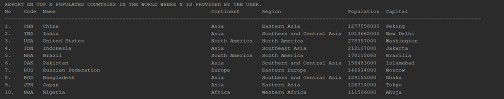 |
| 5     | The top N populated countries in a continent where N is provided by the user. | Yes | 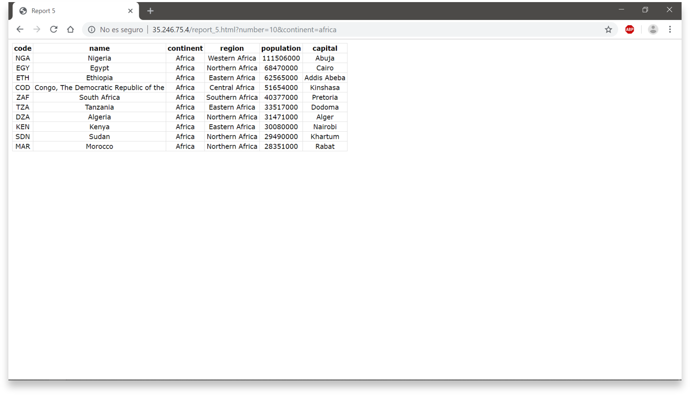 |
| 6     | The top N populated countries in a region where N is provided by the user. | Yes | 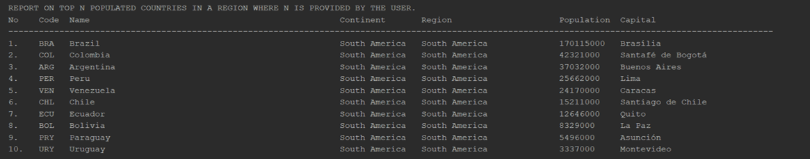 |
| 7     | All the cities in the world organised by largest population to smallest. | Yes | 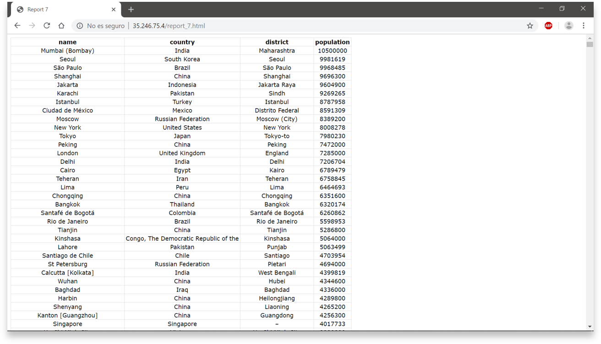 |
| 8     | All the cities in a continent organised by largest population to smallest. | Yes | 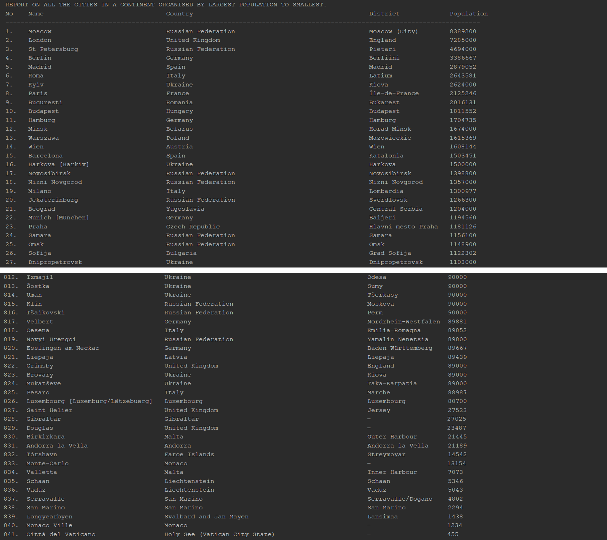 |
| 9     | All the cities in a region organised by largest population to smallest. | Yes | 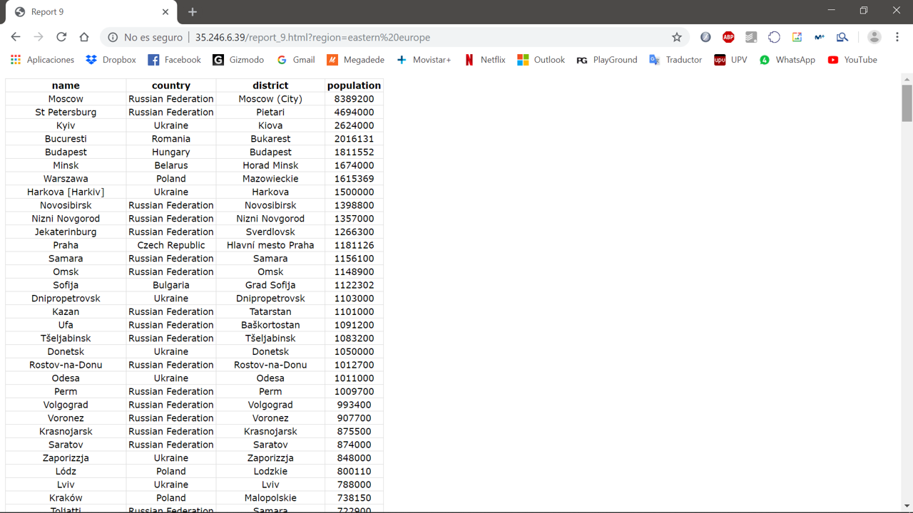 |
| 10    | All the cities in a country organised by largest population to smallest. | Yes | 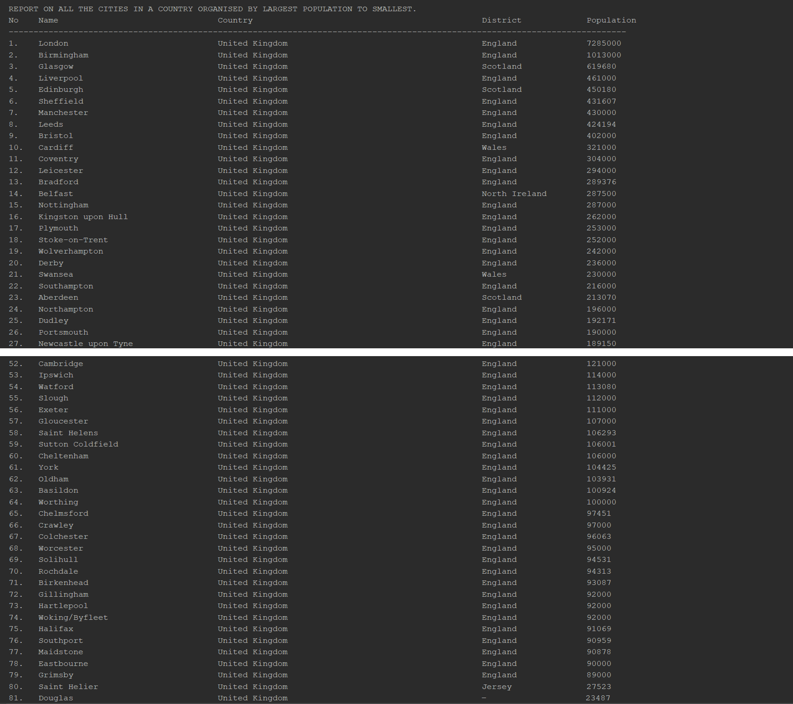 |
| 11    | All the cities in a district organised by largest population to smallest. | Yes |  |
| 12    | The top N populated cities in the world where N is provided by the user. | Yes | 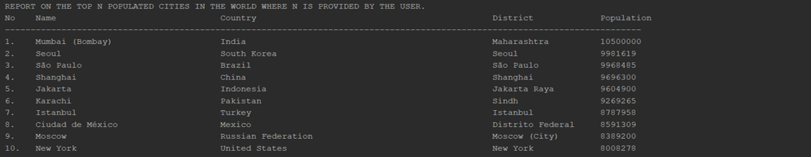 |
| 13    | The top N populated cities in a continent where N is provided by the user. | Yes |  |
| 14    | The top N populated cities in a region where N is provided by the user. | Yes |  |
| 15    | The top N populated cities in a country where N is provided by the user. | Yes | 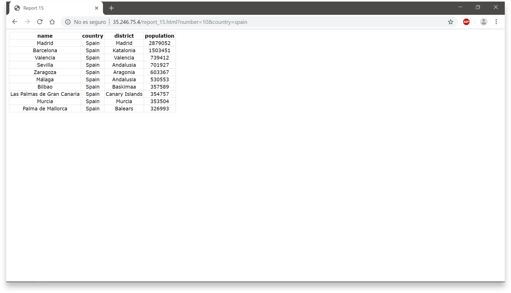 |
| 16    | The top N populated cities in a district where N is provided by the user. | Yes |  |
| 17    | All the capital cities in the world organised by largest population to smallest. | Yes | 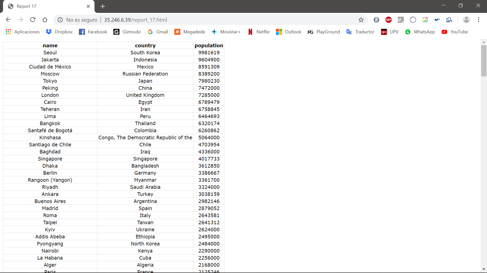 |
| 18    | All the capital cities in a continent organised by largest population to smallest. | Yes | 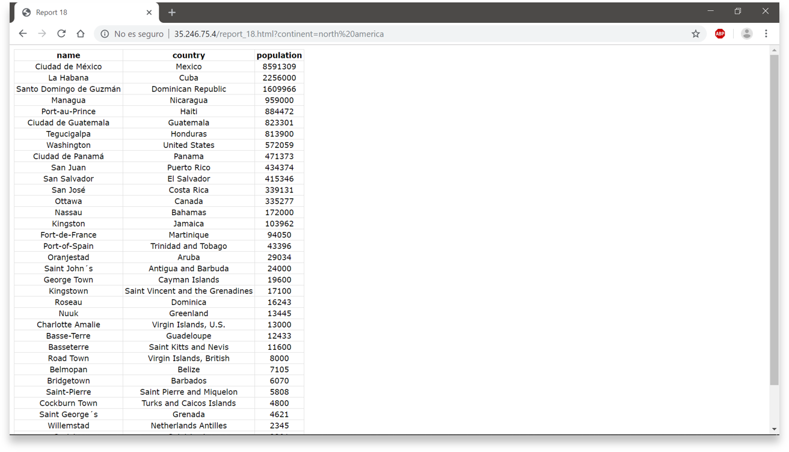 |
| 19    | All the capital cities in a region organised by largest to smallest. | Yes |  |
| 20    | The top N populated capital cities in the world where N is provided by the user. | Yes | 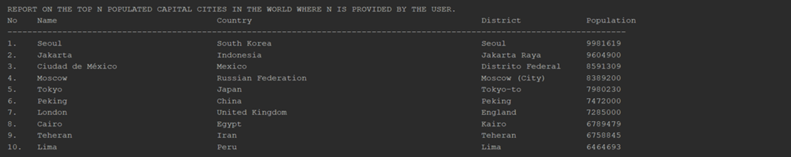 |
| 21    | The top N populated capital cities in a continent where N is provided by the user. | Yes | 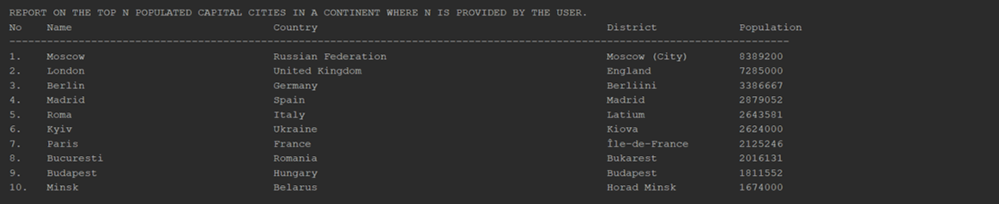 |
| 22    | The top N populated capital cities in a region where N is provided by the user. | Yes | 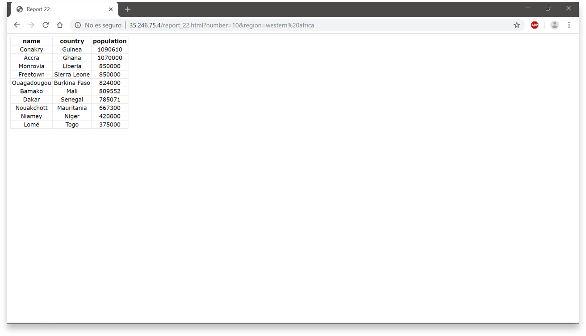 |
| 23    | The population of people, people living in cities, and people not living in cities in each continent. | Yes | 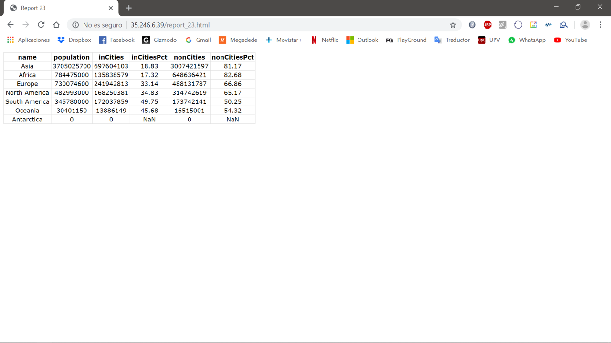 |
| 24    | The population of people, people living in cities, and people not living in cities in each region. | Yes | 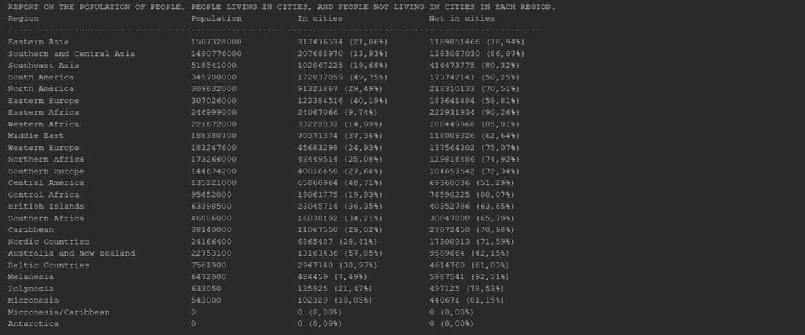 |
| 25    | The population of people, people living in cities, and people not living in cities in each country. | Yes | 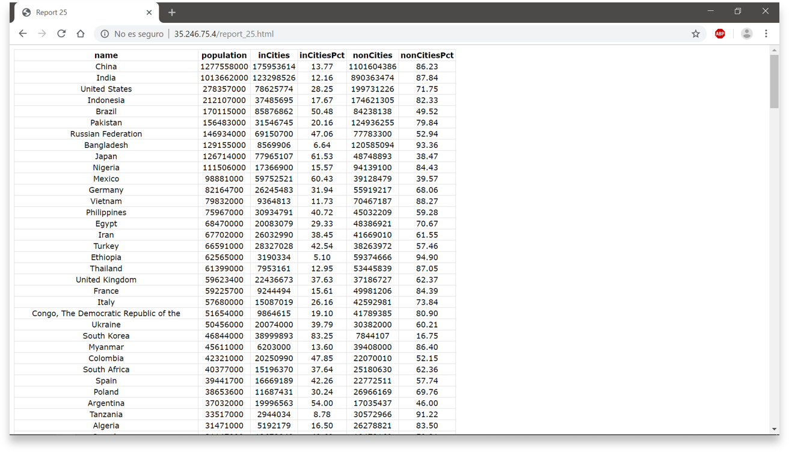 |
| 26    | The population of the world. | Yes | 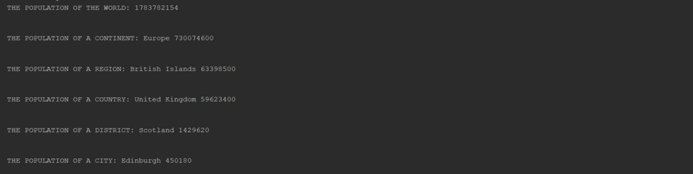 |
| 27    | The population of a continent. | Yes |  |
| 28    | The population of a region. | Yes |  |
| 29    | The population of a country. | Yes |  |
| 30    | The population of a district. | Yes |  |
| 31    | The population of a city. | Yes |  |
| 32    | The number of people who speak Chinese, English, Hindi, Spanish and Arabic from greatest number to smallest, including the percentage of the world population | Yes | 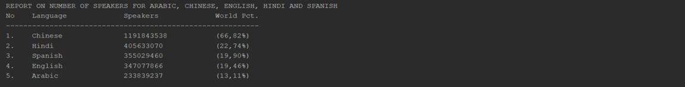 |

## License 

This project is licensed under the Apache-2.0 License - see the [LICENSE](LICENSE) file for details.